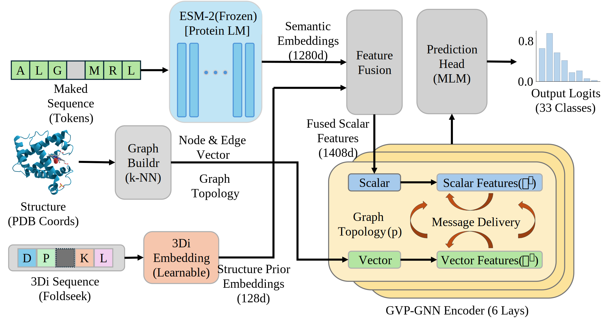
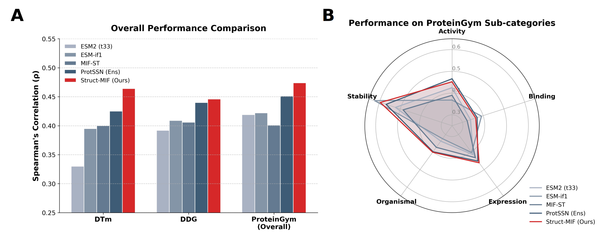

## Introduction

In this study, we proposed a unified multi-modal framework, Struct-MIF, for zero-shot protein mutation effect prediction. Unlike previous sequence-only or structure-only methods, Struct-MIF explicitly integrates evolutionary semantics, discrete structural priors, and continuous geometric constraints to efficiently learn the sequence-structure-function mapping space. This architecture can directly perform zero-shot inferences without the need for expensive downstream fine-tuning.



## Results

### Downloads

- ProteinGym: The pdb files folded by ColabFold 1.5 can be downloaded from https://huggingface.co/datasets/tyang816/ProteinGym_v1/resolve/main/ProteinGym_v1_AlphaFold2_PDB.zip
- **DTM** and **DDG** dataset can be found in [`data/DTM`](https://github.com/tyang816/ProtSSN/tree/master/data/DTM) and [`data/DDG`](https://github.com/tyang816/ProtSSN/tree/master/data/DDG)

### Paper Results

We selected three of the most authoritative benchmark datasets in the field of protein engineering for evaluation: ProteinGym, DTm, and DDG. We compared Struct-MIF with a comprehensive set of pure sequence models, pure structure models, and sequence-structure fusion models. It is important to note that the performance metrics for all baseline models reported in Table 2 were directly adopted from the robust benchmark evaluations conducted by Tan et al. in the ProtSSN study. Spearman's rank correlation coefficient was utilized as the standard evaluation metric.

| Model                        | Version        | Params    | DTm       | DDG       | ProteinGym v1 |           |            |            |           |                 |
| ---------------------------- | -------------- | --------- | --------- | --------- | ------------- | --------- | ---------- | ---------- | --------- | --------------- |
|                              |                | (million) |           |           | Activity      | Binding   | Expression | Organismal | Stability | Overall fitness |
| Sequence encoder             |                |           |           |           |               |           |            |            |           |                 |
| RITA                         | small          | 30        | 0.122     | 0.143     | 0.294         | 0.275     | 0.337      | 0.327      | 0.289     | 0.304           |
|                              | medium         | 300       | 0.131     | 0.188     | 0.352         | 0.274     | 0.406      | 0.371      | 0.348     | 0.350           |
|                              | large          | 680       | 0.213     | 0.236     | 0.359         | 0.291     | 0.422      | 0.374      | 0.383     | 0.366           |
|                              | xlarge         | 1,200     | 0.221     | 0.264     | 0.402         | 0.302     | 0.423      | 0.387      | 0.445     | 0.373           |
| ProGen2                      | small          | 151       | 0.135     | 0.194     | 0.333         | 0.275     | 0.384      | 0.337      | 0.349     | 0.336           |
|                              | medium         | 764       | 0.226     | 0.214     | 0.393         | 0.296     | 0.436      | 0.381      | 0.396     | 0.380           |
|                              | base           | 764       | 0.197     | 0.253     | 0.396         | 0.294     | 0.444      | 0.379      | 0.383     | 0.379           |
|                              | large          | 2700      | 0.181     | 0.226     | 0.406         | 0.294     | 0.429      | 0.379      | 0.396     | 0.381           |
|                              | xlarge         | 6400      | 0.232     | 0.270     | 0.402         | 0.302     | 0.423      | 0.387      | 0.445     | 0.392           |
| ProtTrans                    | bert           | 420       | 0.268     | 0.313     | -             | -         | -          | -          | -         | -               |
|                              | bert_bfd       | 420       | 0.217     | 0.293     | -             | -         | -          | -          | -         | -               |
|                              | t5_xl_uniref50 | 3000      | 0.310     | 0.365     | -             | -         | -          | -          | -         | -               |
|                              | t5_xl_bfd      | 3000      | 0.239     | 0.334     | -             | -         | -          | -          | -         | -               |
| Tranception                  | small          | 85        | 0.119     | 0.169     | 0.287         | 0.349     | 0.319      | 0.270      | 0.258     | 0.288           |
|                              | medium         | 300       | 0.189     | 0.256     | 0.349         | 0.285     | 0.409      | 0.362      | 0.342     | 0.349           |
|                              | large          | 700       | 0.197     | 0.284     | 0.401         | 0.289     | 0.415      | 0.389      | 0.381     | 0.375           |
| ESM-1v                       | -              | 650       | 0.279     | 0.266     | 0.390         | 0.268     | 0.431      | 0.362      | 0.476     | 0.385           |
| ESM-1b                       | -              | 650       | 0.271     | 0.343     | 0.428         | 0.289     | 0.427      | 0.351      | 0.500     | 0.399           |
| ESM2                         | t12            | 35        | 0.214     | 0.216     | 0.314         | 0.292     | 0.364      | 0.218      | 0.439     | 0.325           |
|                              | t30            | 150       | 0.288     | 0.317     | 0.391         | 0.328     | 0.425      | 0.305      | 0.510     | 0.392           |
|                              | t33            | 650       | 0.330     | 0.392     | 0.425         | 0.339     | 0.415      | 0.338      | 0.523     | 0.419           |
|                              | t36            | 3000      | 0.327     | 0.351     | 0.417         | 0.322     | 0.425      | 0.379      | 0.509     | 0.410           |
|                              | t48            | 15,000    | 0.311     | 0.252     | 0.405         | 0.318     | 0.425      | 0.388      | 0.488     | 0.405           |
| CARP                         | -              | 640       | 0.288     | 0.333     | 0.395         | 0.274     | 0.419      | 0.364      | 0.414     | 0.373           |
| Structure encoder            |                |           |           |           |               |           |            |            |           |                 |
| ESM-if1                      | -              | 142       | 0.395     | 0.409     | 0.368         | **0.392** | 0.403      | 0.324      | **0.624** | 0.422           |
| Sequence + structure encoder |                |           |           |           |               |           |            |            |           |                 |
| MIF-ST                       | -              | 643       | 0.400     | 0.406     | 0.390         | 0.323     | 0.432      | 0.373      | 0.486     | 0.401           |
| SaProt                       | masked         | 650       | 0.382     | -         | 0.459         | 0.382     | **0.485**  | 0.371      | 0.583     | 0.456           |
|                              | unmasked       | 650       | 0.376     | 0.359     | 0.450         | 0.376     | 0.460      | 0.372      | 0.577     | 0.447           |
| ProtSSN                      | k20_h512       | 148       | 0.419     | 0.442     | 0.458         | 0.371     | 0.436      | 0.387      | 0.566     | 0.444           |
|                              | Ensemble       | 1467      | 0.425     | 0.440     | **0.466**     | 0.371     | 0.451      | 0.398      | 0.568     | 0.451           |
| struct_mif(our)              | k30_h128       | 657       | **0.464** | **0.446** | 0.452         | 0.364     | 0.461      | **0.402**  | 0.596     | **0.474**       |



Beyond evolutionary fitness, accurately distinguishing pathogenic variants from benign ones in the human genome is crucial for clinical translation. We selected three clinically highly relevant tumor suppressor and metabolic genes (PTEN, TP53, and MSH2) to evaluate the model's classification performance on the ClinVar dataset using the AUC-ROC metric.


## Requirement

### Conda Enviroment

Please make sure you have installed **[Anaconda3](https://www.anaconda.com/download)** or **[Miniconda3](https://docs.conda.io/projects/miniconda/en/latest/)**.

**Enviroment.**

```
conda env create -f environment.yaml
conda activate struct_mif
```

### Hardware

While Table 2. reflects our specific development and pre-training environment, Struct-MIF is designed with parameter efficiency in mind. For researchers aiming to deploy or further fine-tune this architecture, we recommend the following minimum hardware specifications:

For Zero-Shot Inference (Variant Scoring): The model is highly computationally accessible during the inference phase. Evaluating mutational fitness landscapes on target wild-type proteins requires a minimal memory footprint. A standard consumer-grade GPU with at least 8 GB of VRAM (e.g., NVIDIA RTX 3060/4060 or equivalent) is entirely sufficient to run the inference scripts efficiently.

For Multi-modal Pre-training: Due to the memory requirements of loading the 650M-parameter ESM-2 model alongside dynamic 3D k-NN graph batching, pre-training demands higher memory capacity. To maintain a functional batch size (e.g., 16 with automatic mixed precision) without triggering CUDA Out-of-Memory (OOM) errors, we strongly recommend an NVIDIA GPU with a minimum of 24 GB VRAM (e.g., RTX 3090/4090, RTX A5000, or A100). Furthermore, system RAM should ideally be 64 GB or higher (128 GB recommended) to prevent I/O bottlenecks during concurrent multi-worker data loading of massive PDB datasets.

| **hardware**        | **type**                            | **numbers** |
| ------------------- | ----------------------------------- | ----------- |
| CPU                 | Intel(R) Core(TM) i9-14900K         | 1           |
| GPU                 | NVIDIA GeForce RTX 4090 (24GB VRAM) | 1           |
| System Memory (RAM) | 128G                                | 1           |

### Hyperparameters for multi-modal pre-training

| **parameter**               | **values** |
| --------------------------- | ---------- |
| Batch size                  | 16         |
| Gradient accumulation steps | 2          |
| Learning rate               | 1e-4       |
| Epochs                      | 100        |
| Optimizer                   | AdamW      |
| Number of workers           | 8          |


## Quickstart

#### 1. Data Preprocessing

Extract 3D coordinates and 3Di structural tokens from PDB files to build KNN graphs:

```
PYTHONPATH=. nohup python scripts/1_preprocess_graphs.py \
    --input_dir /mnt/data/jzhang/data/CATH \
    --output_dir data/processed_graphs_swissprot \
    --num_workers 16 \
    > preprocess_run.log 2>&1 &

tail -f preprocess_run.log
```

#### 2. Pre-training (Masked Language Modeling)

Pre-train the Struct-MIF model using the processed graphs. You can easily adjust the model capacity and graph topology through command-line arguments:

```
PYTHONPATH=. nohup python scripts/2_pretrain.py \
    --train_path ./data/processed_graphs \
    --esm_model_path ./pretrained_models/esm2_t33_650M_UR50D \
    --output_dir experiments/ablation_hid_128_k_30 \
    --epochs 100 \
    --gvp_layers 6 \
    --batch_size 16 \
    --accum_steps 2 \
    --lr 1e-4 \
    --num_workers 8 \
    --gnn_type gvp \
    --hidden_dim 128 \
    --top_k 30 \
    > experiments/ablation_hid_128_k_30/train.log 2>&1 &
    
    
tail -f experiments/ablation_hid_128_k_30/train.log
```

#### 3. Zero-shot Benchmarking

Evaluate the pre-trained model on downstream tasks without any fine-tuning.

**For DTm / DDG Thermodynamics Benchmarks:**

```
PYTHONPATH=. python scripts/4_benchmark_dtm.py \
    --dtm_root data/DDG/DATASET \
    --checkpoint experiments/test2/checkpoint_epoch_100.pt \
    --esm_model ./pretrained_models/esm2_t33_650M_UR50D \
    --gvp_layers 6 \
    --output_csv experiments/test2/ddg_results_summary.csv \
    --foldseek_bin data/bin/foldseek  \
    --hidden_dim 128 \
    --top_k 30 \
    --gnn_type gvp
```

**For ProteinGym v1 Benchmark:**

```
PYTHONPATH=. python scripts/5_benchmark_proteingym.py \
    --json_file protssn_experiment_plan.json \
    --checkpoint experiments/test2/checkpoint_epoch_100.pt \
    --output_csv experiments/test2/proteingym_results.csv \
    --esm_model ./pretrained_models/esm2_t33_650M_UR50D \
    --foldseek_bin data/bin/foldseek \
    --gvp_layers 6 \
    --hidden_dim 128 \
    --top_k 30 \
    --gnn_type gvp
```

## Project Structure

```
Struct-MIF/
├── configs/                        # Configuration files directory
│   ├── base_config.yaml            # Base model and training configurations
│   ├── inference_zeroshot.yaml     # Zero-shot inference configurations
│   └── train_mlm.yaml              # Specific configurations for MLM pre-training
├── data/                           # Data directory (raw PDBs, processed graphs, and benchmarks)
│   ├── bin/                         
│   │   └── foldseek  
├── experiments/                    # Experiment outputs (model checkpoints and training logs)
├── scripts/                        # Core execution scripts
│   ├── 0_setup_env.sh              # Environment setup script
│   ├── 1_preprocess_graphs.py      # Data preprocessing (PDB -> Graph structures & 3Di      																			features)
│   ├── 2_pretrain.py               # Main model pre-training script (MLM)
│   ├── 3_zero_shot_score.py        # Zero-shot scoring script for single variants
│   ├── 4_benchmark_dtm.py          # DTm/DDG thermodynamics benchmarking script
│   ├── 5_benchmark_proteingym.py   # ProteinGym v1 comprehensive benchmarking script
├── src/                            # Core source code modules
│   ├── common/                     # Common utility classes
│   │   ├── alphabet.py             # Amino acid and 3Di vocabulary definitions
│   │   ├── foldseek_util.py        # Foldseek calling and parsing utilities
│   │   └── pdb_parser.py           # PDB coordinate extraction parser
│   ├── data/                       # Data loading and processing modules
│   │   ├── collator.py             # PyG batching and dynamic masking logic
│   │   ├── dataset.py              # PyTorch dataset classes
│   │   └── graph_builder.py        # KNN graph builder
│   ├── modeling/                   # Neural network architecture definitions
│   │   ├── esm_wrapper.py          # Frozen ESM-2 semantic feature extractor
│   │   ├── fusion.py               # Multi-modal feature fusion module
│   │   ├── gnn_adapters.py         # GCN/GAT/EGNN adapters for ablation studies
│   │   ├── gvp_encoder.py          # Core GVP (Geometric Vector Perceptron) network
│   │   └── struct_mif.py           # Top-level Struct-MIF main model
│   ├── loss.py                     # Loss function definitions (MaskedMLMLoss)
│   └── scoring.py                  # Core logic for zero-shot scoring (Log-Likelihood Ratio)
├── environment.yaml                # Conda cross-platform environment dependencies file
└── protssn_experiment_plan.json    # Experiment plans and benchmark configuration metadata
```

## Pre-trained Weights

We provide the pre-trained weights for the main Struct-MIF model, as well as the variant models used in our ablation studies. 

You can download all the model checkpoints from one drive and place them in the `./experiments/` directory.

### 1. Main Model

This is the primary full-parameter model with the complete multi-modal architecture used for the main results in the paper.

| Model                 | Description                            |                        Download Link                         |
| :-------------------- | :------------------------------------- | :----------------------------------------------------------: |
| **Struct-MIF (Full)** | The complete multi-modal architecture. | [checkpoint_best_model.pt](https://1drv.ms/u/c/E768FE104E832A19/AVFo5unaxhBEndhIWCGVul0?e=CSPaI7) |

### 2. Ablation Study Models

To facilitate reproducibility of our ablation experiments, we also provide the weights for the model variants.

| Model Variant                  | Download Link                                                |
| :----------------------------- | :----------------------------------------------------------- |
| **Struct-MIF (w/o 3DI)**       | [best_checkpoint.pt](https://1drv.ms/u/c/E768FE104E832A19/ARowaWjayNhEiLyxwY6ZW4o?e=lGkaHv) |
| **Struct-MIF (GCN)**           | [best_checkpoint.pt](https://1drv.ms/u/c/E768FE104E832A19/AXHfsYOdhW9Di77MIGZmAJc?e=di5niG) |
| **Struct-MIF (GAT)**           | [best_checkpoint.pt](https://1drv.ms/u/c/E768FE104E832A19/ATIAF5ftdTBPg2NtbPzcRvY?e=eoczHy) |
| **Struct-MIF (EGNN)**          | [best_checkpoint.pt](https://1drv.ms/u/c/E768FE104E832A19/AfnSbWeD2ppEmXPO5bLGuy4?e=aVpTtt) |
| **Struct-MIF (GVP layers=12)** | [best_checkpoint.pt](https://1drv.ms/u/c/E768FE104E832A19/AUmzotE2eU1Ol1Cv862c8eg?e=Sdme3q) |
| **Struct-MIF (GVP layers=18)** | [best_checkpoint.pt](https://1drv.ms/u/c/E768FE104E832A19/AXBlR8slGmpJg7X9okzXdRk?e=tW8gbB) |
| **Struct-MIF (h=256)**         | [best_checkpoint.pt](https://1drv.ms/u/c/E768FE104E832A19/AdfFDQdHO6NBn7eUM_jgN5A?e=aqTYL8) |
| **Struct-MIF (h=512)**         | [best_checkpoint.pt](https://1drv.ms/u/c/E768FE104E832A19/ARNu7-WSGyRIhX5Ln_g9TBk?e=mO4fU4) |
| **Struct-MIF (h=768)**         | [best_checkpoint.pt](https://1drv.ms/u/c/E768FE104E832A19/AaRcnmKNhTxGhkKM2ZDH4vE?e=l8QFCp) |
| **Struct-MIF (k=10)**          | [best_checkpoint.pt](https://1drv.ms/u/c/E768FE104E832A19/AX5Y65BiKSJOmzUjglUnWF0?e=aWRBzg) |
| **Struct-MIF (k=20)**          | [best_checkpoint.pt](https://1drv.ms/u/c/E768FE104E832A19/ARJyo6MnPmFNhB3l58LT-nY?e=GxFQSU) |

> **Note:** If you are only interested in running the standard inference or evaluating on the ProteinGym benchmark, downloading the **Main Model** is sufficient.

## Acknowledgements

Our code is inspired by and built upon several great open-source projects, including [ESM](https://github.com/facebookresearch/esm), [GVP](https://github.com/drorlab/gvp-pytorch), and [Foldseek](https://github.com/steineggerlab/foldseek). We thank the authors for releasing their code.

